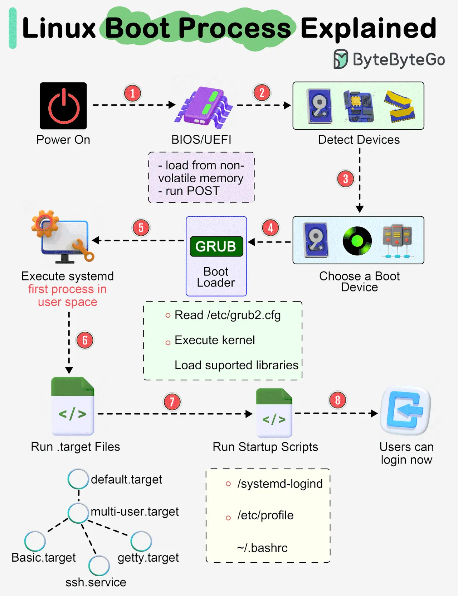

## What is Linux OS?
**Linux®** is an open source operating system (OS). An operating system is the software that directly manages a system’s hardware and resources, like CPU, memory, and storage. The OS sits between applications and hardware and makes the connections between all of your software and the physical resources that do the work.

## How does Linux work?
Linux was designed to be similar to UNIX, but has evolved to run on a wide variety of hardware from phones to supercomputers. Every Linux-based OS involves the Linux kernel—which manages hardware resources—and a set of software packages that make up the rest of the operating system.  
The OS includes some common core components, like the GNU tools, among others. These tools give the user a way to manage the resources provided by the kernel, install additional software, configure performance and security settings, and more. All of these tools bundled together make up the functional operating system. Because Linux is an open source OS, combinations of software can vary between Linux distributions.

## What is the Linux kernel?
The Linux® kernel is the main component of a Linux operating system (OS) and is the core interface between a computer’s hardware and its processes. It communicates between the 2, managing resources as efficiently as possible.  
The kernel has 4 jobs:
- **Memory management**: Keep track of how much memory is used to store what, and where
- **Process management**: Determine which processes can use the central processing unit (CPU), when, and for how long
- **Device drivers**: Act as mediator/interpreter between the hardware and processes
- **System calls and security**: Receive requests for service from the processes

The kernel, if implemented properly, is invisible to the user, working in its own little world known as kernel space, where it allocates memory and keeps track of where everything is stored. What the user sees—like web browsers and files—are known as the user space. These applications interact with the kernel through a system call interface (SCI).

## Where the kernel fits within the OS?
To put the kernel in context, you can think of a Linux machine as having 3 layers:
- **The hardware**: The physical machine—the bottom or base of the system, made up of memory (RAM) and the processor or central processing unit (CPU), as well as input/output (I/O) devices such as storage, networking, and graphics. The CPU performs computations and reads from, and writes to, memory.
- **The Linux kernel**: The core of the OS. (See? It’s right in the middle.) It’s software residing in memory that tells the CPU what to do.
- **User processes**: These are the running programs that the kernel manages. User processes are what collectively make up user space. User processes are also known as just processes. The kernel also allows these processes and servers to communicate with each other (known as inter-process communication, or IPC).

## Linux OS Boot process

- Step 1 - When we turn on the power, BIOS (Basic Input/Output System) or UEFI (Unified Extensible Firmware Interface) firmware is loaded from non-volatile memory, and executes POST (Power On Self Test)
- Step 2 - BIOS/UEFI detects the devices connected to the system, including CPU, RAM, and storage.
- Step 3 - Choose a booting device to boot the OS from. This can be the hard drive, the network server, or CD ROM.
- Step 4 - BIOS/UEFI runs the boot loader (GRUB), which provides a menu to choose the OS or the kernel functions.
- Step 5 - After the kernel is ready, we now switch to the user space. The kernel starts up systemd as the first user-space process, which manages the processes and services, probes all remaining hardware, mounts filesystems, and runs a desktop environment.
- Step 6 - systemd activates the default. target unit by default when the system boots. Other analysis units are executed as well.
- Step 7 - The system runs a set of startup scripts and configure the environment.
- Step 8 - The users are presented with a login window. The system is now ready.

## Files and Folders permissions in Linux

## What is Shell and types of shell in Linux

## RAID in Linux

## LVM

## Networking in Linux

## Process Management in Linux

## What is Inode?

## Namespaces
Linux namespaces are a powerful feature of the Linux kernel that provide a way to isolate and virtualize system resources for processes. They are one of the key technologies behind containerization, allowing multiple isolated instances of system resources to coexist on a single host. Each namespace provides a different type of resource isolation.  
Here are the main types of Linux namespaces:
- Mount Namespace (mnt):
  - Isolates the set of mounted filesystem seen by processes.
  - Processes in different mount namespaces can have different views of the filesystem structure.
  - Changes to the filesystem (like mounting or unmounting) in one namespace do not affect other namespaces.
- Process ID Namespace (pid):
  - Isolates the process ID number space.
  - Processes in different PID namespaces can have the same PID.
  - The init process in a PID namespace has PID 1 within that namespace, allowing for process tree isolation.
- Network Namespace (net):
  - Isolates network-related resources such as network interfaces, IP addresses, routing tables, and firewall rules.
  - Each network namespace has its own network stack, providing full network isolation between namespaces.
- User Namespace (user):
  - Isolates user and group ID number spaces.
  - Allows a process to have different UID and GID mappings inside and outside the namespace.
  - Provides a mechanism for privilege separation, where processes can have root privileges within the namespace but not on the host.
- IPC Namespace (ipc):
  - Isolates inter-process communication resources, such as System V IPC objects (message queues, semaphores, shared memory) and POSIX message queues.
  - Ensures that IPC objects in one namespace are not visible or accessible from other namespaces.
- UTS Namespace (uts):
  - Isolates the system identifiers such as the hostname and the NIS domain name.
  - Processes in different UTS namespaces can have different hostnames.
- Control Group Namespace (cgroup):
  - Isolates the view of the cgroup hierarchy.
  - Processes in different cgroup namespaces can have different views of the cgroup hierarchy, even if they share the same underlying control groups.

## Understanding cgroups
**cgroups** are a Linux kernel feature that enable the management and partitioning of system resources by controlling the resources for a collection of processes. Administrators can use cgroups to allocate resources, set limits, and prioritize processes.  
Different types of available cgroups include CPU cgroup, memory cgroup, block I/O cgroup, and device cgroup.  
While cgroups are not explicitly designed for security, they play a crucial role in controlling and monitoring the resource usage of processes.