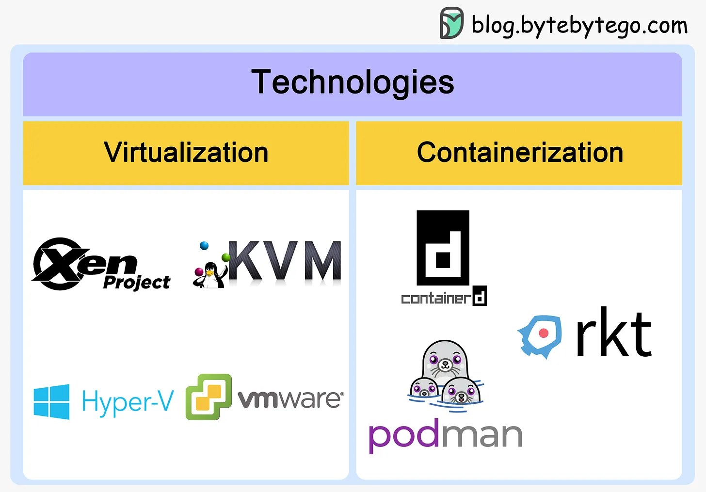
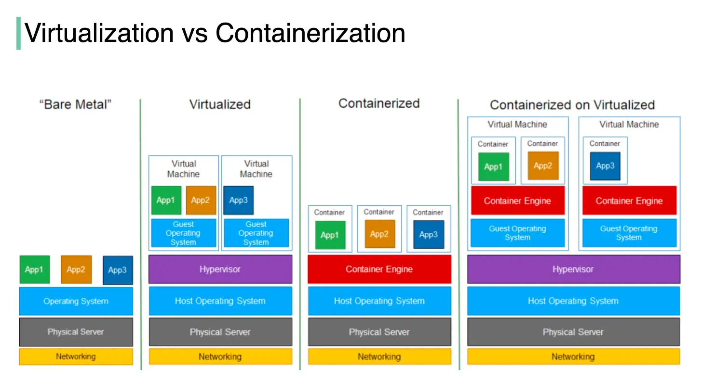
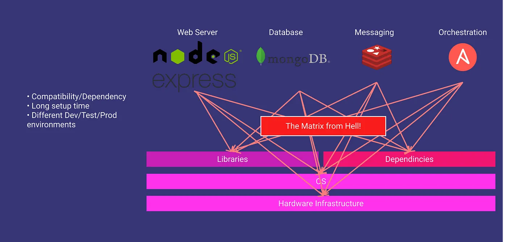
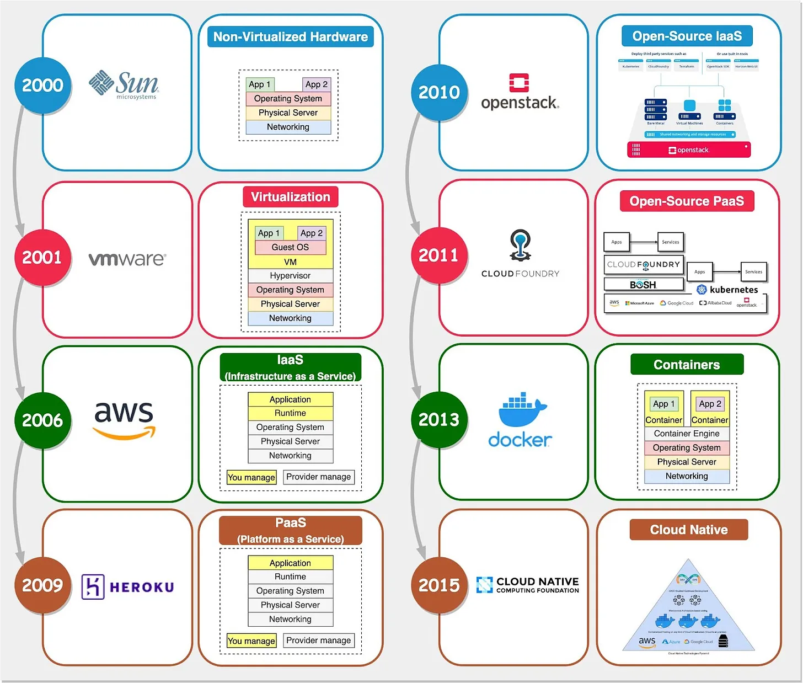

## What is Containerization?
**Containerization** is the packaging together of software code with all its necessary components like libraries, frameworks, and other dependencies so that they are isolated in their own "container".

## What is Virtualization?
**Virtualization** is a technology that allows you to create multiple simulated environments or dedicated resources from a single, physical hardware system.

### Virtualization and Containerization Solution

### Virtualization V/s Containerization

The major differences are:
- In **virtualization**, the hypervisor creates an abstraction layer over hardware, so that multiple operating systems can run alongside each other. This technique is considered to be the first generation of cloud computing.
- **Containerization** is considered to be a lightweight version of virtualization, which virtualizes the operating system instead of hardware. Without the hypervisor, the containers enjoy faster resource provisioning. All the resources (including code, dependencies) that are needed to run the application or microservice are packaged together, so that the applications can run anywhere.

## What is Matrix of Hell?
Let’s say one application relies on a specific version of a software dependency, while another application needs a different version.  
Suddenly, you find yourself juggling two versions of the same software on one system. And it gets even trickier when you start scaling up the system to accommodate more applications. You’ll end up dealing with hundreds of dependencies and various versions, all catering to different applications.  
Trust me, it’s a recipe for chaos and confusion. In the computing world, we call this situation the “Matrix of Hell”.

## Baremetal to Cloud Native

## What is Docker?
**Docker** is an open-source platform that allows you to package, distribute, and run applications in isolated containers. It focuses on containerization, providing lightweight environments that encapsulate applications and their dependencies.

## Docker Architecture

## Docker Components
- **Docker Daemon**: The Docker daemon (**dockerd**) listens for Docker API requests and manages Docker objects such as images, containers, networks, and volumes. A daemon can also communicate with other daemons to manage Docker services.
- **Docker Client**: The Docker client (**docker**) is the primary way that many Docker users interact with Docker. When you use commands such as docker run, the client sends these commands to dockerd, which carries them out. The docker command uses the Docker API. The Docker client can communicate with more than one daemon.
- **Docker Registries**: A Docker registry stores Docker images. Docker Hub is a public registry that anyone can use, and Docker looks for images on Docker Hub by default. You can even run your own private registry.
- **Docker Objects**:
  - **Docker Images**: An image is a read-only template with instructions for creating a Docker container. Often, an image is based on another image, with some additional customization.
  - **Docker Container**: A container is a runnable instance of an image. You can create, start, stop, move, or delete a container using the Docker API or CLI. You can connect a container to one or more networks, attach storage to it, or even create a new image based on its current state. By default, a container is relatively well isolated from other containers and its host machine. You can control how isolated a container's network, storage, or other underlying subsystems are from other containers or from the host machine.

## Underlying Technology
Linux namespaces provide a mechanism for isolating system resources, enabling processes within a namespace to have their own view of the system, such as process IDs, network interfaces, and file systems. Docker uses namespaces to create isolated containers, each with its own set of resources. This ensures application separation and security.  
Docker uses namespaces to provide the isolated workspace called the container. When you run a container, Docker creates a set of namespaces for that container.  
This means that each container has its own isolated namespace for processes, network, mount points, and more.  

The key namespaces in Docker are:
- PID Namespace: Process isolation (PID: Process ID)
  - General Process Sharing: All processes on a system share the same PID namespace.
  - Docker’s Approach: Each container has its own PID namespace, allowing processes within the container to have their unique set of process IDs.
- Net Namespace: Managing network interfaces (NET: Networking)
  - General Process Sharing: Processes often share the same network namespace, leading to potential conflicts.
  - Docker’s Approach: Each container gets its isolated network namespace, enabling independent network configurations and avoiding interference between containers
- IPC Namespace: Managing access to IPC resources (IPC: InterProcess Communication)
  - General Process Sharing: Processes share the same IPC namespace, leading to shared resources and potential conflicts.
  - Docker’s Approach: Containers have separate IPC namespaces, providing isolation for inter-process communication.
- MNT Namespace: Managing filesystem mount points (MNT: Mount)
  - General Process Sharing: Processes typically share the same mount namespace, making file system management challenging.
  - Docker’s Approach: Containers have their own mount namespace, ensuring that file systems are isolated and can be managed independently.
- UTS Namespace: Different host and domain names (UTS: Unix Timesharing System)
  - General Process Sharing: Processes usually share the same UTS namespace, making hostname conflicts possible.
  - Docker’s Approach: Containers have their own UTS namespace, allowing each container to have a unique hostname.
- USER Namespace:
  - General Process Sharing: Processes can see the userIDs and groupIDs of other processes in same namespaces.
  - Docker’s Approch: Isolate the user IDs and group IDs of processes in a container. This means that processes in one container cannot see the user IDs and group IDs of processes in another container.

## Docker Networking

## Docker Volumes

## Docker Compose