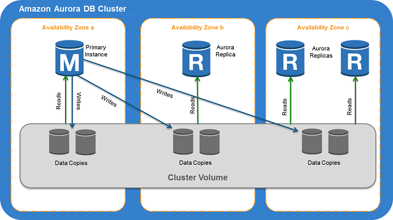

## What is Amazon Aurora?
Amazon Aurora (Aurora) is a fully managed relational database engine that's compatible with MySQL and PostgreSQL.  
Aurora includes a high-performance storage subsystem. Its MySQL- and PostgreSQL-compatible database engines are customized to take advantage of that fast distributed storage. The underlying storage grows automatically as needed. An Aurora cluster volume can grow to a maximum size of 128 tebibytes (TiB). Aurora also automates and standardizes database clustering and replication, which are typically among the most challenging aspects of database configuration and administration.

## Amazon RDS shared responsibility model
Amazon RDS is responsible for hosting the software components and infrastructure of DB instances and DB clusters. You are responsible for query tuning, which is the process of adjusting SQL queries to improve performance. Query performance is highly dependent on database design, data size, data distribution, application workload, and query patterns, which can vary greatly. Monitoring and tuning are highly individualized processes that you own for your RDS databases. You can use Amazon RDS Performance Insights and other tools to identify problematic queries.

## Amazon Aurora DB clusters
An Amazon Aurora DB cluster consists of one or more DB instances and a cluster volume that manages the data for those DB instances. An Aurora cluster volume is a virtual database storage volume that spans multiple Availability Zones, with each Availability Zone having a copy of the DB cluster data.  
Two types of DB instances make up an Aurora DB cluster:
- **Primary DB instance**: Supports read and write operations, and performs all of the data modifications to the cluster volume. Each Aurora DB cluster has one primary DB instance.
- **Aurora Replica**: Connects to the same storage volume as the primary DB instance and supports only read operations. Each Aurora DB cluster can have up to 15 Aurora Replicas in addition to the primary DB instance. Maintain high availability by locating Aurora Replicas in separate Availability Zones. Aurora automatically fails over to an Aurora Replica in case the primary DB instance becomes unavailable. You can specify the failover priority for Aurora Replicas. Aurora Replicas can also offload read workloads from the primary DB instance.

