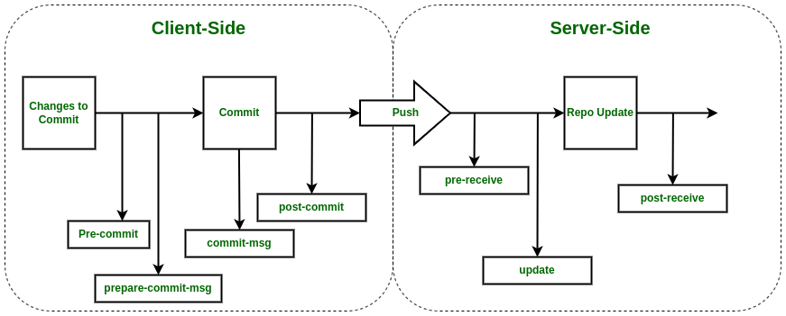

## What is Git?
It is a distributed version control system that allows multiple people to work on a project simultaneously without interfering with each other’s changes. It is widely used for source code management in software development and has become the standard for version control systems.

## Features of Git.
- **Distributed**: **Git** is a distributed version control system that enables developers to work on a codebase without needing to be connected to a central server. This allows for a more flexible and decentralized workflow, as developers can work independently and merge their changes later.
- **Branching and Merging**: **Git** enables developers to create and manage branches of a codebase, which allows for parallel development and experimentation. **Git** also provides tools for merging branches back into the main codebase, ensuring that changes are integrated smoothly.
- **History Tracking**: **Git** maintains a detailed history of all changes made to a codebase, enabling developers to track the evolution of the codebase over time. This history can also be used to revert changes or to identify the source of bugs.
- **Staging**: **Git** provides a staging area, also known as the index, where changes can be reviewed and prepared for committing to the codebase. This enables developers to carefully review and selectively commit changes, rather than committing all changes at once.
- **Speed**: **Git** is designed to be fast, even with large repositories. This is achieved through the use of efficient data structures and algorithms.
- **Security**: **Git** uses cryptographic hashes to ensure the integrity of the codebase. This means that any tampering with the code will be immediately detected.
- **Open Source**: **Git** is an open-source project, which means that anyone can contribute to its development. This has led to a large community of users and contributors who provide support and contribute new features.

## What is Forking?
**Forking** any repository means make a copy of a real repository in your GitHub account and make changes in your copy. Thus, a real repository won’t get affected by your code changes. (After that you have to make a pull request to the real repository for merging your code change, we will come to that part later).

## Basic Git Commands..


## Useful Git Comands List

| **Command**  |   | **Description** |
| :--- | :---: | :--- |
| **git init** |   |  Initialize a local Git repository  |
| **git config --global user.name "your_username"** |   |  Set globally Username  |
| **git config --global user.email "your_email_address@example.com"** |   |  Set globally Email id  |
| **git clone repo_url**  |   |  Clone public repository  |
| **git clone ssh://git@github.com/[username]/[repository-name].git**  |   |  Clone private repository  |
| **git status**  |   |  Check Status  |
| **git add [file-name]**  |   |  Add a file to the staging area  |
| **git add -A**  |   |  Add all new and changed files to the staging area  |
| **git commit -m "[commit message]"**  |   |  Commit changes  |
| **git commit --amend**  |   |  Passing the --amend flag to git commit lets you amend the most recent commit.  |
| **git branch**  |   |  List of branches (the asterisk denotes the current branch)  |
| **git branch -a**  |   |  List all branches (local and remote)  |
| **git branch [branch name]**  |   |  Create a new branch  |
| **git branch -d [branch name]**  |   |  Delete a branch  |
| **git branch -D [branch name]**  |   |  Delete a branch forcefully  |
| **git push origin --delete [branch name]**  |   |  Delete a remote branch  |
| **git checkout -b [branch name]**  |   |  Create a new branch and switch to it  |
| **git checkout -b [branch name] origin/[branch name]**  |   |  Clone a remote branch and switch to it  |
| **git branch -m [old branch name] [new branch name]**  |   |  Rename a local branch  |
| **git checkout [branch name]**  |   |  Switch to a branch  |
| **git checkout -**  |   |  Switch to the branch last checked out  |
| **git checkout -- [file-name.txt]**  |   |  Discard changes to a file  |
| **git fetch**  |   |  Fetching downloads a branch from another repository, along with all of its associated commits and files. But, it doesn't try to integrate anything into your local repository. This gives you a chance to inspect changes before merging them with your project.  |
| **git push origin [branch name]**  |   |  Push a branch to your remote repository  |
| **git push -u origin [branch name]**  |   |  Push changes to remote repository (and remember the branch)  |
| **git push**  |   |  Push changes to remote repository (remembered branch)  |
| **git push origin --delete [branch name]**  |   |  Delete a remote branch  |
| **git pull**  |   |  Update local repository to the newest commit  |
| **git pull origin [branch name]**  |   |  Pull changes from remote repository  |
| **git remote add origin ssh://git@github.com/[username]/[repository-name].git**  |   |  Add a remote repository  |
| **git remote set-url origin ssh://git@github.com/[username]/[repository-name].git**  |   |  Set a repository's origin branch to SSH  |
| **git log**  |   |  View changes  |
| **git log --summary**  |   |  View changes (detailed)  |
| **git log --oneline**  |   |  View changes (briefly)  |
| **git diff [source branch] [target branch]**  |   |  Preview changes before merging  |
| **git revert commitid**  |   |  Revert commit changes  |
| **git merge [branch name]**  |   |  Merge a branch into the active branch  |
| **git merge [source branch] [target branch]**  |   |  Merge a branch into a target branch  |
| **git merge --squash**  |   |  Combines all changes being merged in a branch into a single commit  |
| **git merge --no-commit**  |   |  Combines branches into the current branch without creating a new commit  |
| **git merge --no-ff**  |   |  Creates a merge commit rather than attempting a fast-forward  |
| **git clean**  |   |  Removes untracked files from the working directory. This is the logical counterpart to git reset, which (typically) only operates on tracked files.  |
| **git rebase [target branch name]**  |   |  Rebase your currently checked out branch onto a target branch. This rewrites a commit(s) from the source branch and applies it on the top of the target branch. The resulting linear history is often much easier to understand and explore.  |
| **git rebase -i**  |   |  The -i flag is used to begin an interactive rebasing session. This provides all the benefits of a normal rebase, but gives you the opportunity to add, edit, or delete commits along the way.  |
| **git rebase --onto [newbase]**  |   |  Reapplies commits onto a new base, disregarding the previous base branch. It is important to remember that one should never rebase commits once they are pushed to the public repository  |
| **git reflog**  |   |  Git keeps track of updates to the tip of branches using a mechanism called reflog. This allows you to go back to changesets even though they are not referenced by any branch or tag.  |
| **git reset**  |   |  Undoes changes to files in the working directory. Resetting lets you clean up or completely remove changes that have not been pushed to a public repository.  |
| **git reset HEAD~3**  |   |  Undo the latest commit but leave the working directory unchanged. You can undo as many commits as you want by changing the number after the tilde  |
| **git reset --hard HEAD~3**  |   |  Discard all changes of the latest commit (no easy recovery). Instead of HEAD~n, you can provide commit hash as well. Changes after that commit will be destroyed.  |
| **git stash**  |   |  Create a stash with local modifications and revert back to the head commit.  |
| **git stash list**  |   |  Display a list of all stashes in your repository.  |
| **git stash show**  |   |  View the content of your most recent stash. This will show your stashed changes as a diff between the stashed content and the commit from back when the stash was created.  |
| **git stash drop [stash]**  |   |  Remove a stash from the list of stashes in your repository.  |
| **git stash pop [stash]**  |   |  Apply a stash to the top of the current working tree and remove it from your list of stashes.  |
| **git stash apply [stash]**  |   |  Apply a stash on top of the current working tree. The stash will not be removed from your list of stashes.  |
| **git stash clear**  |   |  Remove all stashes from your repository.  |
| **git restore**  |   |  Discarding or unstaging uncommitted local changes  |
| **git reflog**  **git checkout [commit-hash]**  |   |  If Git is a time machine, then reflog is the black box recorder. It keeps track of all the time travel you've done. Did you accidentally delete a branch? No worries, Reflog has got you covered.  |
| **git tag [tag_name] [commit_hash]**  |   |  The git tag command can be used to create, list, delete, and verify tags. Tags are references that point to a specific point in a repo and are often used to mark important commits.  |
| **git cherry-pick [commit-hash]**  |   |  It lets you choose a commit from a branch (the tree) and apply it to another. This is handy when you've fixed a bug in a development branch and must use the fix in the production branch without integrating any other changes.  |
| 
```console
**Start a bisect session**
git bisect start

**Mark the current state as bad**
git bisect bad

**Mark the last known good state**
git bisect good [commit-hash]
```
  |   |  Hunting for a bug in a commit is akin to finding a needle in a haystack. The bisect command is your high-tech metal detector. By marking a good commit (no needle) and a bad commit (with a needle), Git bisect will guide you to the offending commit most efficiently.  |

## Git Merge Workflow
Consider what happens when you start working on a new feature in a dedicated branch, then another team member updates the main branch with new commits.


Now, let’s say that the new commits in main are relevant to the feature that you’re working on. To incorporate the new commits into your feature branch, you have two options: merging or rebasing. The easiest option is to merge the main branch into the feature branch using something like the following:  
```console
git merge feature main
```
This creates a new “merge commit” in the feature branch that ties together the histories of both branches, giving you a branch structure that looks like this:


Merging is nice because it’s a non-destructive operation. The existing branches are not changed in any way. This avoids all of the potential pitfalls of rebasing. On the other hand, this also means that the feature branch will have an extraneous merge commit every time you need to incorporate upstream changes. If main is very active, this can pollute your feature branch’s history quite a bit. It can make it hard for other developers to understand the history of the project.

## Git Rebase Workflow
We can rebase the feature branch onto main branch using the following commands: 
```console
git checkout feature
git rebase main
```
This moves the entire feature branch to begin on the tip of the main branch, effectively incorporating all of the new commits in main. 

The major benefit of rebasing is that you get a much cleaner project history. First, it eliminates the unnecessary merge commits required by git merge. Second, as you can see in the above diagram, rebasing also results in a perfectly linear project history—you can follow the tip of feature all the way to the beginning of the project without any forks.

## Interactive rebasing
Interactive rebasing gives you the opportunity to alter commits as they are moved to the new branch. This is even more powerful than an automated rebase, since it offers complete control over the branch’s commit history. Typically, this is used to clean up a messy history before merging a feature branch into main.  
To begin an interactive rebasing session, pass the i option to the git rebase command:
```console
git checkout feature
git rebase -i main
```
This will open a text editor listing all of the commits that are about to be moved:
```console
pick 33d5b7a Message for commit #1
pick 9480b3d Message for commit #2
pick 5c67e61 Message for commit #3
```
This listing defines exactly what the branch will look like after the rebase is performed. By changing the pick command and/or re-ordering the entries, you can make the branch’s history look like whatever you want. For example, if the 2nd commit fixes a small problem in the 1st commit, you can condense them into a single commit with the fixup command:
```console
pick 33d5b7a Message for commit #1
fixup 9480b3d Message for commit #2
pick 5c67e61 Message for commit #3
```
When you save and close the file, Git will perform the rebase according to your instructions, resulting in project history that looks like the following:


## The golden rule of rebasing
The golden rule of git rebase is to never use it on public branches.  
For example, think about what would happen if you rebased main onto your feature branch:

The rebase moves all of the commits in main onto the tip of feature. The problem is that this only happened in your repository. All of the other developers are still working with the original main. Since rebasing results in brand new commits, Git will think that your main branch’s history has diverged from everybody else’s.

The only way to synchronize the two main branches is to merge them back together, resulting in an extra merge commit and two sets of commits that contain the same changes (the original ones, and the ones from your rebased branch). Needless to say, this is a very confusing situation.

So, before you run git rebase, always ask yourself, “Is anyone else looking at this branch?” If the answer is yes, take your hands off the keyboard and start thinking about a non-destructive way to make your changes (e.g., the git revert command).

### Force Pushing
If you try to push the rebased main branch back to a remote repository, Git will prevent you from doing so because it conflicts with the remote main branch. But, you can force the push to go through by passing the --force flag. This overwrites the remote main branch to match the rebased one from your repository and makes things very confusing for the rest of your team. So, be very careful to use this command only when you know exactly what you’re doing.

## Merge Strategy
- **Fast Forward**: The Fast Forward Merge takes place when the destination branch of the merge does not contain any new commits. In such a case, only the pointer of the branch is moved forward to the required commit. It does not add any new commits.  

Example of merging Feature on Master:  

- **Recursive Merge**: The Recursive Merge takes place where both the source & destination branches of the merge contain new commits. In such a case, a new commit is introduced in the destination branch, merging all changes.  

Example of merging Master on Feature:  


## What are Git Hooks
Like many other Version Control Systems, Git has a way to fire off custom scripts when certain important actions occur. There are two groups of these hooks: client-side and server-side. Client-side hooks are triggered by operations such as committing and merging, while server-side hooks run on network operations such as receiving pushed commits.  

- **Client-Side Hooks**
  - **Committing-Workflow Hooks**
    - pre-commit hook: The pre-commit hook is run first, before you even type in a commit message. It’s used to inspect the snapshot that’s about to be committed, to see if you’ve forgotten something, to make sure tests run, or to examine whatever you need to inspect in the code. Exiting non-zero from this hook aborts the commit.
    - prepare-commit-msg hook: The prepare-commit-msg hook is run before the commit message editor is fired up but after the default message is created. It lets you edit the default message before the commit author sees it. This hook generally isn’t useful for normal commits; rather, it’s good for commits where the default message is auto-generated, such as templated commit messages, merge commits, squashed commits, and amended commits.
    - commit-msg hook: The commit-msg hook takes one parameter, which again is the path to a temporary file that contains the commit message written by the developer. If this script exits non-zero, Git aborts the commit process, so you can use it to validate your project state or commit message before allowing a commit to go through.
    - post-commit hook: After the entire commit process is completed, the post-commit hook runs. It doesn’t take any parameters, but you can easily get the last commit by running git log -1 HEAD. Generally, this script is used for notification or something similar.
  - **Email Workflow Hooks**
    - applypatch-msg hook: Git aborts the patch if this script exits non-zero. You can use this to make sure a commit message is properly formatted, or to normalize the message by having the script edit it in place.
    - pre-applypatch hook: You can run tests or otherwise inspect the working tree with this script. If something is missing or the tests don’t pass, exiting non-zero aborts the git am script without committing the patch.
    - post-applypatch hook: It runs after the commit is made. You can use it to notify a group or the author of the patch you pulled in that you’ve done so.
  - **Other Client Hooks**
    - pre-rebase hook: The pre-rebase hook runs before you rebase anything and can halt the process by exiting non-zero. You can use this hook to disallow rebasing any commits that have already been pushed.
    - post-rewrite hook: The post-rewrite hook is run by commands that replace commits, such as git commit --amend and git rebase.
    - post-checkout hook: After you run a successful git checkout, the post-checkout hook runs; you can use it to set up your working directory properly for your project environment.
    - post-merge hook: The post-merge hook runs after a successful merge command. You can use it to restore data in the working tree that Git can’t track, such as permissions data. This hook can likewise validate the presence of files external to Git control that you may want copied in when the working tree changes.
    - pre-push hook: The pre-push hook runs during git push, after the remote refs have been updated but before any objects have been transferred.
- **Server-Side Hooks**
  - pre-receive: The first script to run when handling a push from a client is pre-receive. It takes a list of references that are being pushed from stdin; if it exits non-zero, none of them are accepted. You can use this hook to do things like make sure none of the updated references are non-fast-forwards, or to do access control for all the refs and files they’re modifying with the push.
  - update: The update script is very similar to the pre-receive script, except that it’s run once for each branch the pusher is trying to update. If the pusher is trying to push to multiple branches, pre-receive runs only once, whereas update runs once per branch they’re pushing to.
  - post-receive: The post-receive hook runs after the entire process is completed and can be used to update other services or notify users. This script can’t stop the push process, but the client doesn’t disconnect until it has completed, so be careful if you try to do anything that may take a long time.

