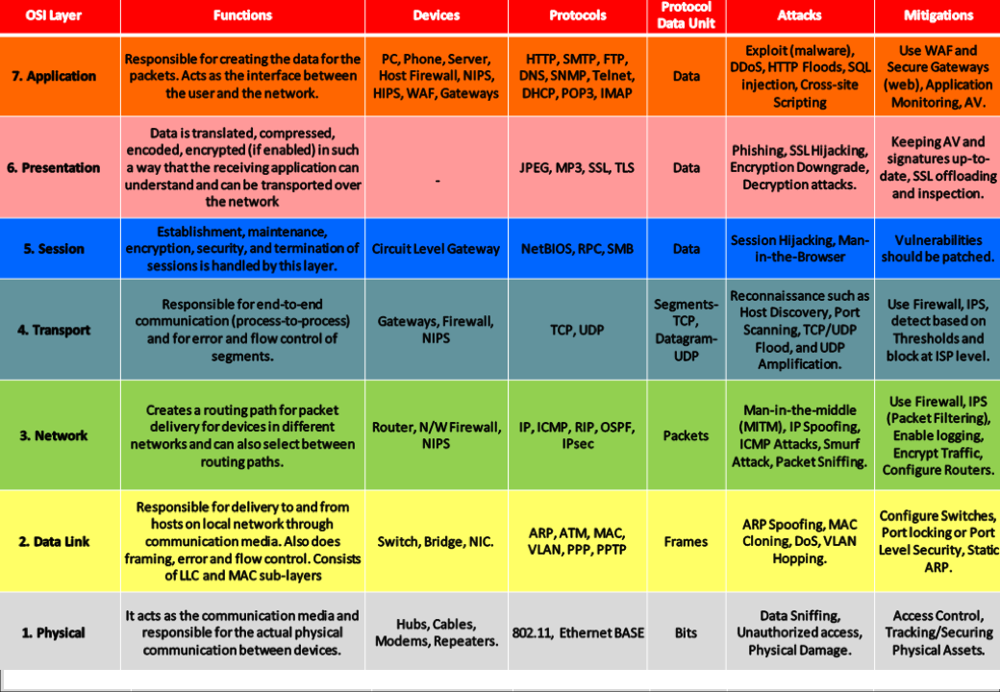

# Networking
**Networking** is the practice of connecting computers and other devices to share resources, exchange data, and communicate over wired or wireless connections.

## Types of Computer Network
**LAN**: Local Area Network(LAN) is a network that covers small area, such office or home.  
**MAN**: Metropolitan Area Network (MAN) is a type of computer network that spans over a metropolitan area, typically a city.  
**WAN**: Wide Area Network(WAN) is a network that covers large geographical area, such as city, country, or even entire world.  

## OSI Model
**Open Systems Interconnection**(OSI) is a reference model that specifies standards for communication protocols and also functionalities of each layer.  

## Networking Devices
- Router: A router is a device that forwards data packets between computer networks, creating an overlay internetwork. It routes the data from the source network to the destination network, based on the IP address in the packet headers.  
- Hub: A hub is a basic networking device that connects multiple Ethernet devices, making them act as a single network segment. It broadcasts incoming data packets to all ports, regardless of the destination.
- Bridge: A bridge is a network device that connects multiple network segments at the data link layer (Layer 2) of the OSI model. It filters traffic and reduces collisions.
- Switch: A network switch is a device that connects devices within a local area network (LAN) and uses MAC addresses to forward data to the correct destination.
- Repeater: A repeater is a network device that regenerates and amplifies signals to extend the distance they can travel over a network.
- Access Point: An access point is a device that allows wireless devices to connect to a wired network using Wi-Fi or related standards. It extends the physical range of a wireless network.
- Gateway: A gateway is a network node that serves as an access point to another network, often involving protocol conversion. It connects different networks and translates data between them.
- Network Interface Card (NIC): A NIC is a hardware component that connects a computer to a network. It provides the physical interface for network connectivity and handles data conversion.
- Firewall: A firewall is a network security device that monitors and controls incoming and outgoing network traffic based on predetermined security rules.

## Network Topology
The **Network Topology** is the layout arrangement of the different devices in a network.
Examples:
- Star
- Mesh
- Point-to-Point
- Ring
- Tree
- Daisy Chain
- Hybrid

## Protocols
A protocol is a set of rules or algorithms which define the way how two entities can communicate across the network.  

1. **Layer 7 Protocols (Application Layer)**
   1. **SOAP** (Simple Object Access Protocol): It is a messaging protocol specification for exchanging structured information in the implementation od webservice in computer networks.
   2. DHCP
   3. DNS
   4. BOOTP (Bootstrap Protocol)
   5. HTTP
   6. HTTPS
   7. NFS (Network File System)
   8. POP3 (Post Office Protocol)
   9. SMTP (Simple Mail Transfer Protocol)
   10. SNMP (Simple Network Management Protocol)
   11. FTP
   12. SFTP
   13. NTP (Network Time Protocol)
   14. IRC (Internet Relay Chat)
   15. Telnet
   16. SSH
   17. IMAP (Internet Message Access Protocol)
2.  **Layer 6 Protocols (Presentation Layer)**
    1.  TLS
    2.  SSL
    3.  LPP (Lightweight Presentation Protocol)
    4.  XDR (eXternal Data Representation)
    5.  X.25
3. **Layer 5 Protocols (Session Layer)**
   1. H.245
   2. iSNS
   3. NetBIOS
   4. RPC
   5. SMB
   6. SMPP
   7. SOCKS
4. **Layer 4 Protocols (Transport Layer)**
   1. iSCSI (Internet Small Computer System Interface)
   2. SCTP (Stream Control Transmission Protocol)
   3. TCP
   4. UDP
   5. QUIC
   6. FCP (Fibre Channel Protocol)
   7. DCCP (Datagram Congestion Control Protocol)
5. **Layer 3 Protocols (Network Layer)**
   1. NAT
   2. IP
   3. ICMP
   4. ARP
   5. IPSEC
   6. OSPF (Open Shortest Path First)
   7. VRRP (Virtual Router Redundancy Protocol)
6. **Layer 2 Protocol (DataLink Layer)**
   1. VLAN